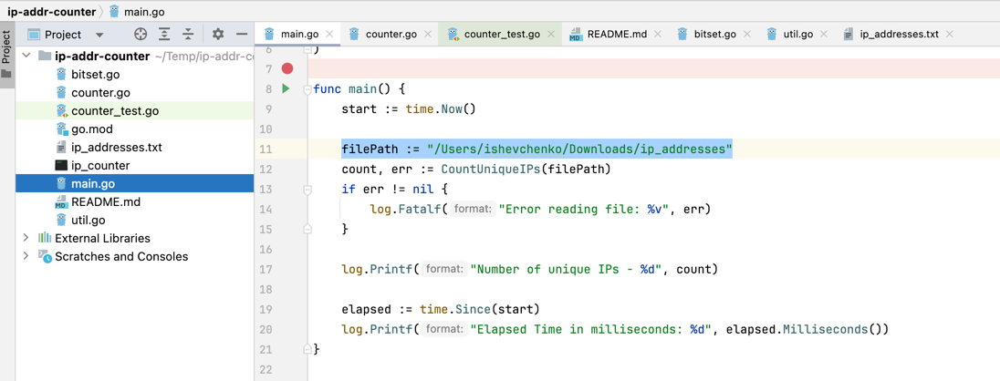
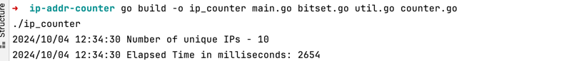

# ecwid
The application is designed to calculate the number of unique ip addresses in the file using as little memory and time as possible.

The file could be unlimited in size and can occupy tens and hundreds of gigabytes.

## Project setup
 - Make sure you have go1.22.4 or later installed
 - Clone the repository and navigate to the `main.go.main()#filePath` where you can specify path to your file with IP addresses 

[](img.png)

 - Compile and run all files together using the command below:
```
go run main.go bitset.go util.go counter.go
```

 - If you prefer to build a binary first, you can use:
```
go build -o ip_counter main.go bitset.go util.go counter.go
./ip_counter
```

[](img_1.png)

### Run test

- Run the following commands to execute tests
```
 go test -v
```

## Description
The solution is designed to count unique IPv4 addresses from a specified text file containing a list of IP addresses. It consists of four main components:

- `main.go`: The entry point of the application. It reads the file path for the IP addresses, invokes the counting function, and logs the number of unique IPs and the time taken for the operation.

- `counter.go`: This file includes the CountUniqueIPs function, which handles reading the file **line by line**. It utilizes a BitSet data structure to track unique IP addresses efficiently. Each IP is converted to a numeric format and its corresponding bit is set in the BitSet.

- `bitset.go`: This file defines the BitSet struct, which maintains an array of bits to represent the presence of IP addresses. It provides methods to set a bit and count the total number of unique bits set, allowing for efficient storage and retrieval of unique IPs.

- `util.go`: This file contains utility functions for converting IP addresses from their string representation to a long integer format. The textToLong function converts an IP address to a numeric format, while textToNumericFormatV4 handles the string parsing to ensure valid IP addresses are correctly interpreted.

Overall, this solution efficiently counts unique IP addresses in large datasets while maintaining modularity and testability.

As an output the program logs the total count of unique IP addresses and the time taken to process the file.

## Result
I.e. results from processing of [115GB file](https://ecwid-vgv-storage.s3.eu-central-1.amazonaws.com/ip_addresses.zip) is shown bellow:
```
2024/10/04 12:48:01 Number of unique IPs - 1000000000
2024/10/04 12:48:01 Elapsed Time in milliseconds: 551245
```

Go solution is a little bit faster rather then [Java solution](https://github.com/igoryok/ip-addr-counter-java?tab=readme-ov-file#result)